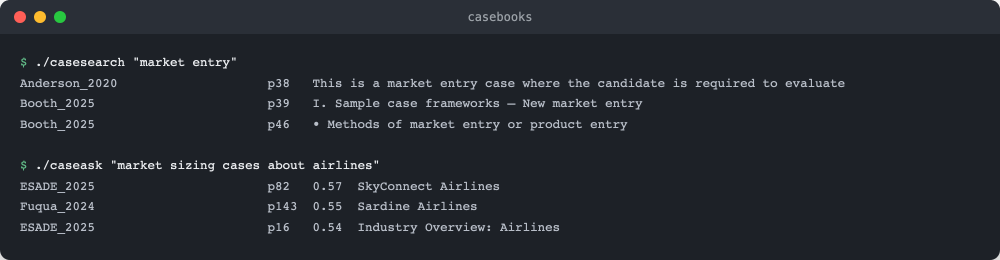
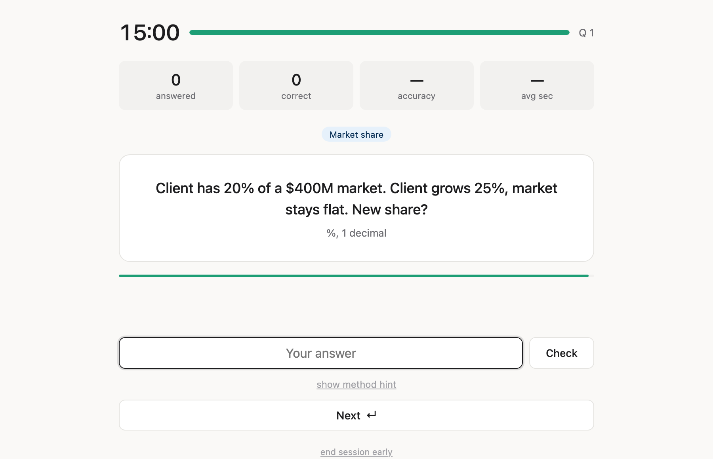

# casebooks

Searchable library of 20 MBA consulting casebooks, plus a mental math drill.

I built this for my girlfriend while she recruits for MBB consulting, and she uses it regularly. Finding a case by industry or concept takes seconds instead of flipping through PDFs, and [Case Math Drill](https://casedrills.vercel.app) covers the mental-math half of prep.

**→ [casedrills.vercel.app](https://casedrills.vercel.app)**



## how it works

`casesearch` greps the full text of every book and prints the school and exact PDF page; a second argument restricts it to one school. `caseask` is for when you can't remember the wording: it searches by meaning, entirely on your machine, no API keys. `render-pages Columbia_2021 144 146` turns exhibit pages into PNGs and opens them.

[Case Math Drill](https://casedrills.vercel.app) is the practice side: timed questions across 20 topics, from multiplication and percentages up to break-even, CAGR, NPV and LTV, each with a time limit and a method hint. Per-topic accuracy is saved in the browser.



The books come from [Hacking the Case Interview](https://www.hackingthecaseinterview.com/pages/mba-consulting-casebooks). What each one contributes is in [COVERAGE.md](COVERAGE.md), and the math from all 20 is distilled into [case_interview_math.md](case_interview_math.md).

## run it locally

```
git clone https://github.com/joudbitar/casebooks.git
cd casebooks
./download_casebooks.sh      # fetches the 20 PDFs
./scripts/extract_text.sh    # builds the text index (needs poppler's pdftotext)
```

The first `./caseask` run creates a Python env with uv and builds the embeddings index. That takes a few minutes, once.

## how it's built

Two bash scripts, two Python scripts, and one HTML file. No server, no database.

- `casesearch` is a single awk pass. pdftotext separates pages with form-feed characters, so counting them while matching maps every hit back to its real PDF page. The "index" is 20 plain text files.
- `caseask` embeds 4,013 page-sized chunks with model2vec's potion-base-8M, a static embedding model that runs locally with no GPU, and ranks queries by cosine similarity.
- Case Math Drill is one HTML file with zero external references. vercel.json is four lines: serve the `app` directory, no framework.
- The PDFs are not committed. `download_casebooks.sh` rebuilds the whole library from source URLs.

## what it doesn't do

- Built on and for macOS. `render-pages` opens Preview, and the scripts assume poppler and uv are installed. Linux is probably close but untested.
- `casesearch` is a grep, not a search engine. No ranking, no fuzzy matching.
- Drill progress lives in localStorage. No accounts, no sync; clear the browser and it's gone.

## license

MIT. The casebooks themselves belong to their schools; this repo only stores links to them.
